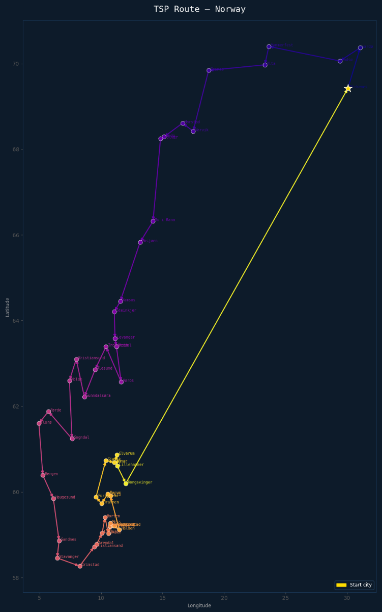
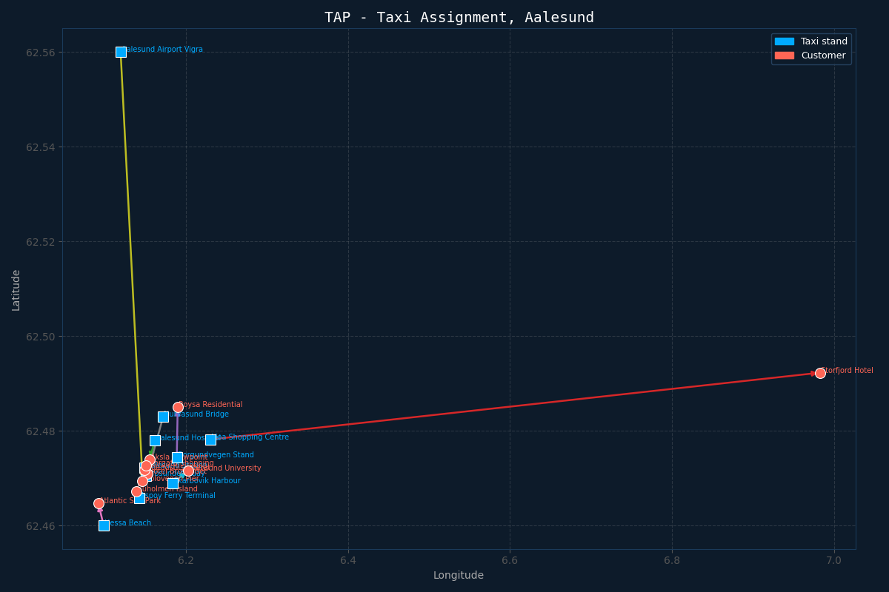

# Ant Colony Optimization for Travelling Salesman and Task Assignment Problem (Norway)

A C++ implementation of the Ant Colony Optimization (ACO) algorithm to solve the Travelling Salesman Problem (TSP) across 50 Norwegian cities, and the Task Assignment Problem (TAP) assigning 10 taxis to 10 customers in Aalesund. Includes Python visualization scripts for both problems.

<p align="center">
  
  
</p>

## Overview

**TSP:** Finds the shortest possible route visiting all 50 Norwegian cities exactly once and returning to the starting point.

**TAP:** Assigns 10 taxis to 10 customers in Aalesund in a way that minimizes the total distance traveled by all taxis.

In both cases, ants build solutions probabilistically based on pheromone trails and edge distances, with better solutions reinforcing their pheromone trails over generations.

## How It Works

Each generation:
1. A fresh population of ants is placed at random starting positions
2. Each ant builds a complete solution using pheromone levels and edge distances
3. Costs are calculated using a precomputed cost matrix
4. Pheromone trails are updated where a better solutions deposit more pheromone
5. The best solution found so far is tracked across all generations

The pheromone update follows the standard ACO formula:

$$\tau_{ij} = (1 - \rho)\tau_{ij} + \sum_{k=1}^{m} \Delta\tau_{ij}^k$$

Where $\rho$ is the evaporation rate and $\Delta\tau_{ij}^k = 1/L_k$ for edges used by ant $k$.

## Configuration

In `main.cpp`, set `solveTSP = true` for TSP or `false` for TAP:
```cpp
bool solveTSP = true;  // true = TSP, false = TAP
```

**TSP parameters:**
```cpp
int numberOfCities = 50;    // up to 50
int populationSize = 100;   // ants per generation
int maxGenerations = 500;
float alpha = 1;            // pheromone weight
float beta  = 5;            // distance weight (higher = more greedy)
```

**TAP parameters:**
```cpp
int n = 10;                 // taxis and customers
int populationSize = 100;
int maxGenerations = 500;
float alpha = 0.5;
float beta  = 7;
```

**Tuning tips:**
- `beta` should generally be higher than `alpha` (e.g. `alpha=1, beta=3-5`)
- Higher `beta` = greedier, converges faster
- Higher `alpha` = follows pheromones more strongly, can get stuck
- Higher `rho` = pheromones evaporate faster, more exploration 

## Project Structure
```
├── main.cpp               # Entry point, mode switch, and ACO loop
├── makePopulation.hpp     # TSP: City data, population initialization, route building
├── travelTCP.hpp          # TSP route distances and pheromone update
├── travelTAP.hpp          # TAP location data, assignment building, scoring, pheromone update
├── testRouteTCP.py        # TSP visualization script
├── testRouteTAP.py        # TSP visualization script
└── testConvergence.py     # Convergence visualization script
```

## Visualization

**TSP** - paste your route when prompted:
```bash
python draw_route.py
Enter route: 0 4 8 12 16 ...
```

**TAP** - paste your assignment output when prompted:
```bash
python draw_tap.py
Paste assignment output lines, then press Enter twice:
Taxi Aalesund Station -> Customer Jugendstilsenteret
...
```

## Cities and Locations

The TSP dataset contains 50 of the largest Norwegian cities with approximate lat/lon coordinates. The TAP dataset contains 10 taxi hotspots and 10 customer locations in Aalesund.

## Example Output

**TSP:**
```
Generation 0: Best distance = 14823
Generation 100: Best distance = 11240
...
Best route found: 0 4 16 10 6 21 12 14 15 ...
Total distance: 8943
```

**TAP:**
```
Generation 0: Best cost = 1.06
Generation 10: Best cost = 0.98
...
OPTIMAL FOUND in generation 47
Taxi Aalesund Station -> Customer Jugendstilsenteret
Total distance: 0.922441
```
